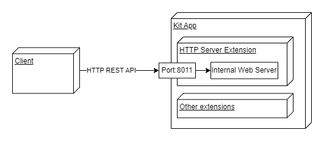

# Kit HTTP Server Setup Guide
## Problem
There is a need to be able to ingress command and control messages from an external client into a running Kit instance. This would allow client software to affect the running scene.

## Design
The high-level architecture looks like the following:



We take advantage of the built-in web server from `omni.services`, where we register our HTTP endpoints with the `main` module.

## Code
We start by creating a new Kit extension, and specifying the two extensions in the `[dependencies]` section of the `extension.toml` file:
```
[dependencies]
"omni.services.core" = {}
"omni.services.transport.server.http" = {}
```
In the main extension file, we add the following logic to register an HTTP endpoint:
```
import omni
from omni.services.core import main

class MyExtension(omni.ext.IExt):
    def on_startup(self, ext_id):
        print("Server startup")

        async def command(message):
            # Do whatever you'd like here
            print(f'Received: {message}')

        main.register_endpoint("get", "/command/{message}", command)

    def on_shutdown(self):
        print("Server shutdown")
```
After enabling the extension, we can test the endpoint using `curl`:
```
curl http://localhost:8111/command/hey
```
You should see the message `hey` printed in the Python console.

Note that we are using port 8111, since I am testing this extension in USD Composer. Different Kit apps come with different default ports:
```
Port 8011 -> Default + USD Presenter
Port 8111 -> USD Composer
Port 8211 -> Isaac Sim
```
You can always specify a port using the following Kit setting
```
--/exts/omni.services.transport.http.server/port=8011
```

## Additional Resources
- [`omni.services.core`](https://docs.omniverse.nvidia.com/services/latest/core/index.html) documentation for deeper dive into architecture and functionality.
- ["Companion Code to *A Deep Dive into Building Microservices with Omniverse*"](https://github.com/NVIDIA-Omniverse/deep-dive-into-microservices). This project contains the 2 extensions created during the GTC November 2021 presentation on microservices, which serve as a demonstration of the flexibility of this architecture. (Potentially out-of-date)
- ["Tutorial: Implementing a Viewport Capture Service"](https://docs.omniverse.nvidia.com/services/latest/tutorials/viewport-capture/implementing_the_service.html) (up-to-date)
- ["Introduction: Transports"](https://docs.omniverse.nvidia.com/services/latest/transports/index.html). Transports allow different protocols and communication channels to be used with the Omniverse microservices stack.
